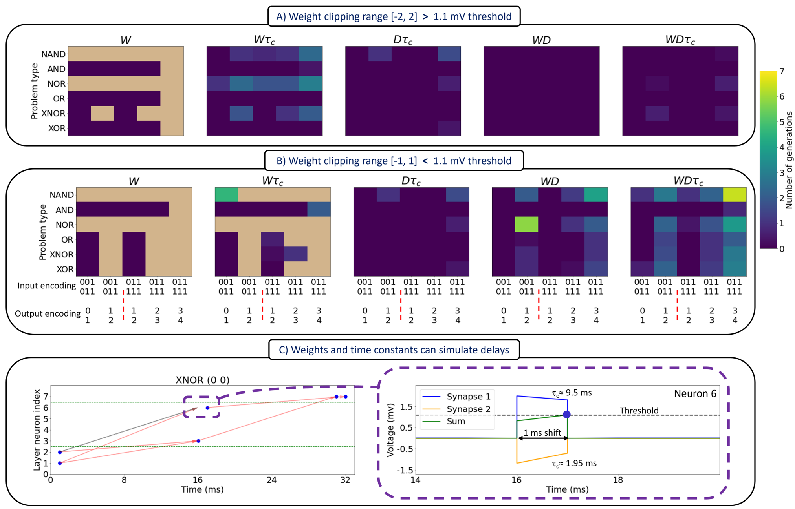

This is the repository for the paper: "Adapting to time why nature may have evolved a diverse set of neurons"

Paper url:

This code uses the conda environment: NeuromorphEnv

## Notes:
The simulations were performed using 4 3090 GPUs, it is recommended to use such a setting. However, the code can also run with 1 GPU.

All the simulations can take several weeks, so kindly have have this in mind when running them.

## Instructions:
### Main studies
  -Go to Main and then go to the psettings file \
  -In the psettings one can choose which experiment to run by setting its flag to True (and others to False) in the EXP_FLAGS variable \
  -The settings for each simulations is in its designated "get_exp_number", for example the first experiment is "get_exp_one" \
  -The affected plots in the paper are in the docstring of the experiment \
  -The meaning of each simuation parameter is in the get_exp_one setting
### Noise studies
  -These are the simulations for Fig.5 in the paper \
  -Go to main.py and choose which simulation to perform \
  -The associated parameters are listed under

## Abstract:
Brains have evolved diverse neurons with varying morphologies and dynamics that impact temporal information processing. In contrast, most neural network models use homogeneous units that vary only in spatial parameters (weights and biases). To explore the importance of temporal parameters, we trained spiking neural networks on tasks with varying temporal complexity, holding different parameter subsets constant. We found that adapting conduction delays is crucial for solving all test conditions under tight resource constraints. Remarkably, these tasks can be solved using only temporal parameters (delays and time constants) with constant weights. In more complex spatio-temporal tasks, an adaptable bursting parameter was essential. Overall, allowing adaptation of both temporal and spatial parameters enhances network robustness to noise, a vital feature for biological brains and neuromorphic computing systems. Our findings suggest that rich and adaptable dynamics may be the key for solving temporally structured tasks efficiently in evolving organisms, which would help explain the diverse physiological properties of biological neurons.

## Example results:

### Adapting delays but not weights is necessary to solve a set of semi-temporal logic problems

We find that evolving weights alone does not result in solutions to all problems as shown in the above figure. These subfigures show the number of generations needed to reach a perfect solution (zero loss) for a given combination of i) co-mutated parameters, ii) input-output encoding, iii) logic problem type, and iv) weight clipping range. The weight clipping range is a hyperparameter that is used during evolution to restrict the values a parameter, in this case weights, can take. We use subthreshold ([-1, 1]) mV and suprathreshold ([-2, 2]) mV clipping ranges as they exemplify networks that are restricted to values inclusive or exclusive of the threshold value of 1.1 mV. In this figure, each grid pattern represents an average of five trials and each trial involves populations with approximately two million solutions. The number of generations was employed as an indirect measure of the ease of finding a perfect solution. Thus, from an evolutionary perspective, fewer generations suggests that a given set of neuronal parameters is more favorable to co-mutate to increase the chances of survival of an individual. A trial involves running the evolutionary algorithm for twenty generations.

